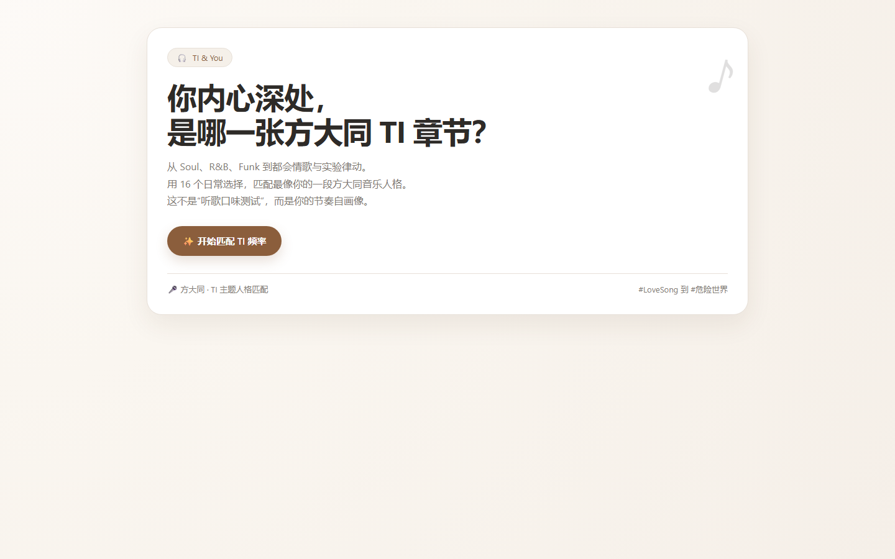
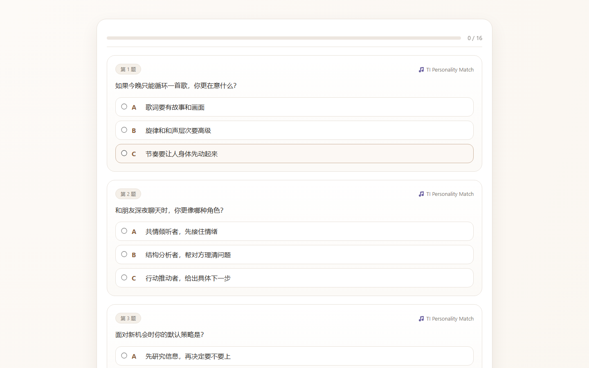
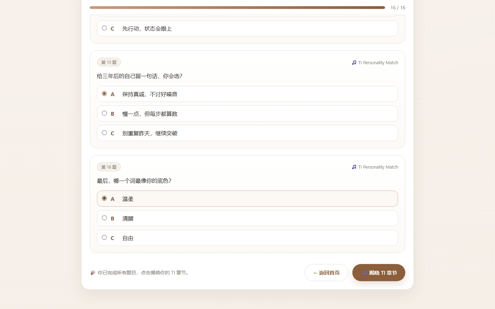

# 方大同 TI 测试

一个关于方大同（Khalil Fong）的趣味知识测试，测试你对这位灵魂乐歌手的了解程度。

## 预览

<table>
  <tr>
    <td align="center"><b>落地页</b></td>
    <td align="center"><b>答题页</b></td>
  </tr>
  <tr>
    <td></td>
    <td></td>
  </tr>
  <tr>
    <td align="center"><b>答题进度</b></td>
    <td align="center"><b>测试结果</b></td>
  </tr>
  <tr>
    <td></td>
    <td></td>
  </tr>
</table>

## 功能

- **趣味知识测试** — 多道关于方大同的选择题，涵盖音乐、专辑、经历等
- **即时反馈** — 选择后立即显示对错，附带解析
- **结果评级** — 根据得分给出不同等级的评价
- **暗色主题** — 沉浸式视觉体验

## 技术栈

- 原生 HTML / CSS / JavaScript
- 数据驱动：题目通过 JS 数据结构管理

## 运行

直接用浏览器打开 `index.html`，或启动本地服务器：

```bash
python -m http.server 5000
```

然后访问 `http://localhost:5000`。
